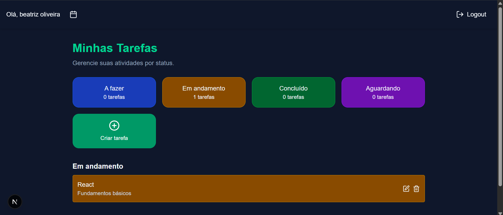
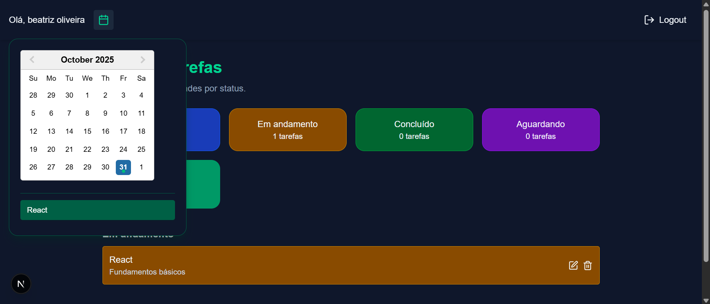
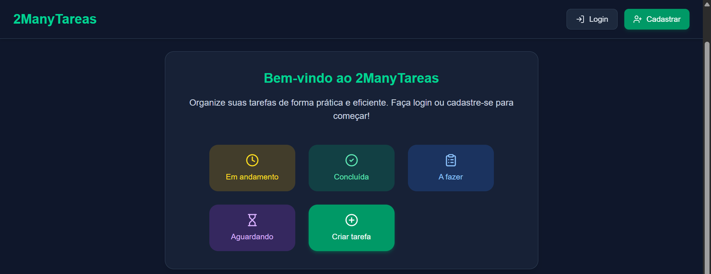

# 🧩 Frontend - 2ManyTareas
Interface web moderna e responsiva desenvolvida com **Next.js**, **TypeScript** e **Tailwind CSS**, responsável pela experiência do usuário do sistema **2ManyTareas** — uma aplicação para controle de tarefas e produtividade.

---

## 🚀 Tecnologias utilizadas

- **Next.js 14+** — Framework React com suporte a rotas dinâmicas e SSR.  
- **TypeScript** — Tipagem estática para maior segurança e escalabilidade.  
- **Tailwind CSS** — Estilização rápida e consistente.  
- **Lucide Icons** — Ícones modernos e personalizáveis.  
- **React DatePicker** — Componente de calendário customizado.  
- **Axios / Fetch API** — Comunicação com o backend Flask.  

---

## ⚙️ Estrutura do projeto

```
frontend/
├── app/
│   ├── cadastro/
│       ├── page.tsx 
│   ├── home/
│       ├── page.tsx                
│   ├── login/
│       ├── page.tsx 
│   ├── favicon.ico
│   ├── global.css
│   ├── layout.tsx
│   └── page.tsx  
├── components/           
│   ├── Calendar.tsx
│   ├── Header.tsx
│   ├── HeaderPublic.css
│   ├── ModalTarefa.tsx
│   └── TaskList.tsx  
├── lib/                   
│   └── api.ts
│   ├── tasks.ts
│   ├── types.ts
│   └── useauth.ts  
├── node_modules/
├── public/                
├── .gitignore
├── eslint.config.mjs
├── index.tsx
├── next-env.d.ts
├── next.config.mjs
├── package-lock.json
├── package.json
├── postcss.config.mjs
├── tsconfig.json             
└── README.md
```

---

## 🧰 Pré-requisitos

Antes de iniciar, verifique se você possui instalado em sua máquina:

- [Node.js 18+](https://nodejs.org/)
- [npm](https://www.npmjs.com/) ou [yarn](https://yarnpkg.com/)

---

## ▶️ Como executar o projeto

### 1. Instale as dependências
```bash
npm install
# ou
yarn install
```

### 2. Crie um arquivo `.env.local`
Exemplo:
```env
NEXT_PUBLIC_API_URL=http://127.0.0.1:5000
```

### 3. Execute o servidor de desenvolvimento
```bash
npm run dev
# ou
yarn dev
```

O projeto estará disponível em:
👉 [http://localhost:3000](http://localhost:3000)

---

## 🌙 Tema e UI

O design segue uma identidade visual escura com tons de **verde e azul**, transmitindo modernidade e foco.  
Todos os componentes foram desenvolvidos com **responsividade** e **usabilidade** em mente, adaptando-se a diferentes tamanhos de tela.

---

## 🔗 Integração com o Backend

O frontend se comunica com a API desenvolvida em **Flask**, responsável pelo gerenciamento de:
- Usuários e autenticação (login/cadastro)
- Tarefas e status
- Progresso das atividades

As rotas são configuradas via `.env.local`, permitindo fácil alternância entre ambiente local e produção.

Exemplo de integração com API Flask:

```ts
import axios from "axios";

const api = axios.create({
  baseURL: process.env.NEXT_PUBLIC_API_URL,
});

export async function getTasks() {
  const response = await api.get("/tarefas");
  return response.data;
}
```

---

## 🧪 Scripts disponíveis

| Comando              | Descrição |
|----------------------|-----------|
| `npm run dev`        | Inicia o servidor de desenvolvimento |
| `npm run build`      | Gera a versão otimizada para produção |
| `npm start`          | Executa a versão buildada |
| `npm run lint`       | Verifica e corrige erros de lint |

---

## 🖼️ Pré-visualização

### 🏠 Tela inicial


### 📅 Calendário de tarefas


### ✅ Status das tarefas


---

## 👩‍💻 Desenvolvido por

**Beatriz Bramont**  
💼 Estagiária em TI | Desenvolvedora Full Stack em formação  
🌐 [GitHub](https://github.com/beatrizbramont)

---

> “Organize suas ideias, priorize suas tarefas e torne sua rotina mais leve — com 2ManyTareas.”

