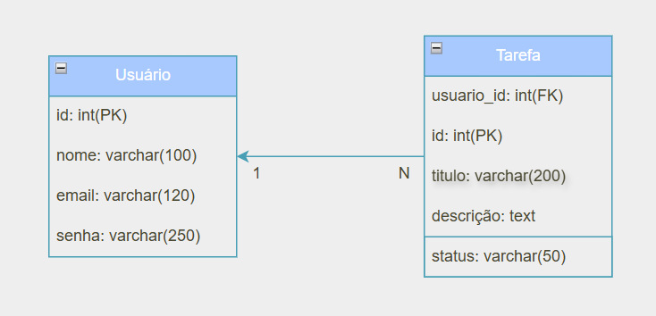

# 2ManyTareas - Gerenciamento de Tarefas

## 💡 Propósito e Ideia Geral

O **2ManyTareas** é uma aplicação web para gerenciamento de tarefas do dia a dia, desenvolvido utilizando a arquitetura MVC para melhor controle. A proposta é oferecer uma plataforma simples e eficiente para organizar atividades pessoais ou profissionais. Entre as funcionalidades principais estão:

- Cadastro/Login/Logout de usuários;
- Cadastro de tarefas;
- Definição e alteração do status da tarefa (ex: "A fazer", "Em andamento", "Concluído");
- Visualização das tarefas organizadas por status;
- Visualização de um calendário para controle e planejamento.

---

## 🎯 Público-Alvo

- Usuários individuais que desejam organizar tarefas;
- Pequenos times que precisam de uma solução simples para acompanhamento de atividades;
- Estudantes e profissionais buscando produtividade com organização visual.

---

## 🚀 Como Rodar a API

### ✅ Pré-requisitos

- Python 3.7 ou superior instalado
- Git instalado (opcional para clonar o repositório)
- Ambiente virtual (recomendado)

### ⚙️ Passos para rodar localmente

1. **Clone o repositório:**

```bash
git clone https://github.com/beatrizbramont/FullStackProject.git
cd FullStackProject/backend
```

2.*** Ativar o ambiente virtual:***
```bash
venv/Scripts/activate
```

3. ***Instalar as dependências:***
```bash
pip install -r requirements.txt
```

4. ***Executar a aplicação:***
```bash
python app.py
```

## Documentação
Para visualizar a documentação basta acessar o link: <br>
📍 http://127.0.0.1:8001/apidocs/

## Docker
### Pré-requisitos
- Ter o Docker instalado na sua máquina e certificar-se de que está aberto quando for rodar os comandos da aplicação.

### Como rodar
1. ***Estar na pasta backend***
```bash
cd backend
```

2. ***Crie a imagem Docker***
```bash
docker build -t backend .
```

3. ***Rode o container***
```bash
docker run -p 8001:8001 backend
```

4. ***Acesse no navegador***
```bash
http://localhost:8001
```

## Diagrama ER


## Tecnologias utilizadas:
- Python;
- Flask;
- Flask-SQLAlchemy;
- SQLite;
- Flasgger (Swagger para documentação);
- Dotenv;
- Docker.